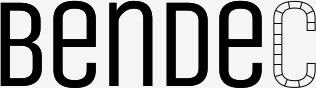

### Binary encoder / decoder featuring fixed-size arrays

Supports: Primitives, Structs, Enums, Unions, Arrays, Aliases

Generators: Rust, TypeScript, C++

```js
const bendec = new Bendec({
    definitions, // todo
    getVariant   // todo
})

// get your Buffer from somewhere
const buffer = Buffer.alloc(bendec.getSize('User'))

// wrap the buffer 
const user = bendec.wrap('User', buffer)

// just get / set properties
user.firstName = 'Lorem'
// nested object
user.address.postcode = 'E1 123'

// your Buffer is now updated
console.log(buffer)

```
